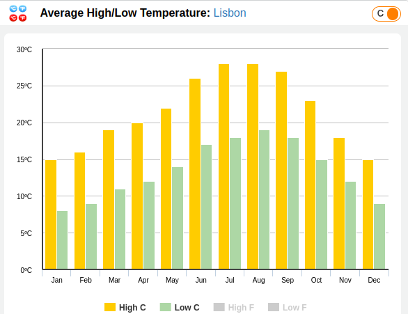
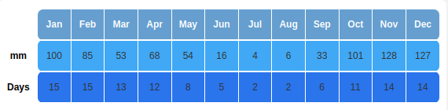

# Portugal - Lisbon

Portugal:
* same size as hungary
* 5% more people than hungary

Lisbon:

* 500k people
* ~+15% more expensive than Budapest
* ~+50% more expensive housing than Budapest
* overally budgetfriendly
* cheapest way to check the city and have some sightseeing: Tram28
* Note: on Tram28, there is some pickpocket danger
* Don't bring your high heels: cobblestones are everywhere
* Cheap public transport, almost impossible to park you car
* Use reloadable card for transports
* friendly/helpful locals
* Shop/eat outside baxia district too
* Eat outside the restaurant streets
* eat late, stay out late, party late
* dinner after 7 in restaurants
* check uma bica (coffee)
* check tosta mista (sandwich)
* recommended: pasteis de belém,copenhagen cafe, heim cafe
* events: Santos Festival in June: music+grilled fish
* 10+ museums
* sightseeing elevators
* Airbnbs drowe out lots of the locals from the inner districts
* Hostels are really-really good if you need temporary stay
* affordable healthcare
  

* Can be rainy
  

<a href="https://www.europainstitut.hu/index.php/24-sonstiges/911-allampolgarsag-besznyak">Kettős állampolgárság</a>