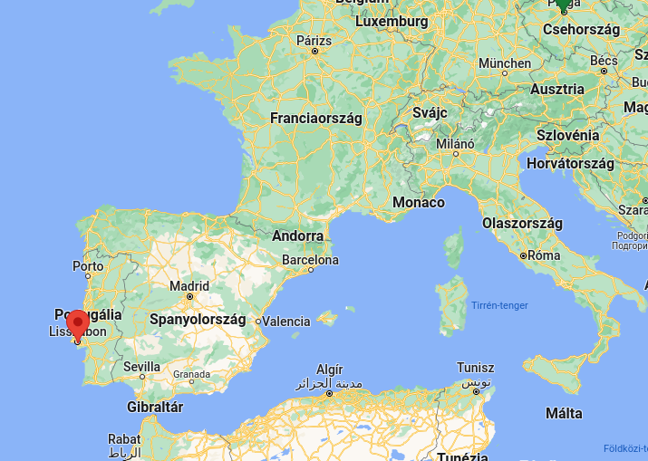

# Portugal - Lisbon

* 500k fő
* ~+15%-kal drágább mint Bp. Housing +50%
* Tram28 - olcsó módja h körülnézz, minden körül végigmegy, itt van csak főleg pickpocket danger
* mindenhol macskakő
* public transport olcsó, parkolás elégszar
* use reloadable kártya utazáshoz
* friendly/helpful locals
* baxia districten kívül is lehet vásárolni/enni
* ne (csak) a tourist restaurant utcában egyé
* vacsi after 7 után
* if snack -> uma bica (kave + süti), tosta mista (szendvics)
* pasteis de belém nagyon ajánlott
* Santos Festival in June: zene, grilled halak
* muzeumok
* kilátóliftek
* airbnbk kiszorítottak sokakat belvárosból, de jók a hostelek
* budgetfriendly
* hűvös tud lenni
* eat late, stay out late, party late
* megfizethető egészségügy
* copenhagen cafe, heim cafe

<a href="https://www.europainstitut.hu/index.php/24-sonstiges/911-allampolgarsag-besznyak">Kettős állampolgárság</a>